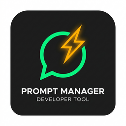

# AI Prompt File Manager

<p align="center">
  
</p>

# Prompt Manager

Keep your AI prompts as ordinary `.md` / `.txt` files, find them with a keystroke, and get
them into a chat panel without hunting through folders.

The file system is the single source of truth. There is no hidden database and no in-memory
cache of snippet bodies: a snippet is read from disk at the moment you insert it, so what
you paste is always what is on disk right now. Point the global folder at your Obsidian
vault and the same files serve both tools.

## Features

- **Quick insert** — `Ctrl+Alt+P` opens a searchable list of every snippet across both
  scopes, with scope badges and subfolder paths. Picking one copies it to the clipboard.
- **Two scopes** — *Global* snippets follow you between projects; *Workspace* snippets live
  in the repo (`.vscode/prompts` by default) and can be committed with it.
- **Nested folders** — organise snippets into subfolders; they appear as groups in the tree
  and as a path in the Quick Pick, so search still finds everything.
- **Tree view** — a Prompt Manager container in the Activity Bar with create, rename,
  delete and reveal actions. **Clicking a snippet inserts it**; the pencil on the right of
  the row opens it for editing.
- **Hover to preview** — hovering a snippet shows the start of its text, read on demand so
  that building the tree never touches file contents. Long prompts are clipped to 15 lines.
- **Open in Obsidian** — jump from a snippet to the same file in your vault.
- **Live refresh** — the tree follows changes made outside VS Code.

## Getting started

1. Open the **Prompt Manager** view in the Activity Bar.
2. Press **New Snippet**, choose a scope, and give it a title. The file is created and
   opened for editing; the folder is created for you if it does not exist.
3. Press `Ctrl+Alt+P` (`Cmd+Alt+P` on macOS) anywhere, pick the snippet, and paste.

From the tree, a single click on a snippet inserts it — the whole row is the target, since
that is the action you repeat all day. Editing is the pencil icon on the row, and both
actions are also listed by name in the right-click menu.

A title may contain `/` to nest: `review/security` creates `review/security.md`.

## What actually gets inserted where

VS Code isolates extension code from other extensions' webviews. That has a concrete
consequence worth stating plainly:

| Target | What works |
|---|---|
| GitHub Copilot Chat | Can be **prefilled** via `workbench.action.chat.open`, which puts the snippet in the input without sending it. |
| Quick Chat | Can be prefilled via `workbench.action.openQuickChat`. |
| A normal text editor | Can be pasted or inserted at the cursor. |
| Claude Code, Antigravity, and other chat webviews | **No API can type into them.** Their focus commands ignore arguments. |

So the snippet is **always copied to the clipboard first**, and only then does the extension
make a best-effort attempt at a real insertion. If nothing can insert it, `Ctrl+V` still
works — that is the guarantee.

Configure the attempt order with **Prompt Manager: Configure Insert Strategy...**, which
lists only the commands actually available in your window. For a chat panel that cannot be
typed into, set `promptManager.insert.focusCommand` (for example `claude-vscode.focus` or
`antigravity.panel.focus`) to focus its input so you can paste immediately.

One caveat the notification wording reflects: a chat command with no chat provider
installed resolves successfully while doing nothing, and that is not detectable. The
message therefore says *"Copied ... , ran &lt;command&gt;"* rather than claiming the text
was inserted.

## Settings

| Setting | Default | What it does |
|---|---|---|
| `promptManager.global.path` | *(extension storage)* | Global snippet folder. Supports `~`, `${userHome}`, `${env:NAME}`. Point it at your Obsidian vault. |
| `promptManager.workspace.path` | `.vscode/prompts` | Workspace snippet folder, per workspace folder. |
| `promptManager.global.enabled` / `workspace.enabled` | `true` | Show or hide a scope. |
| `promptManager.fileExtensions` | `[".md", ".txt"]` | Which files count as snippets. |
| `promptManager.newSnippet.extension` | `.md` | Extension for newly created snippets. |
| `promptManager.excludeGlobs` | `node_modules`, `.git`, `.obsidian` | Subfolders to skip. |
| `promptManager.maxDepth` | `8` | Subfolder nesting depth to scan. |
| `promptManager.maxFileSizeKb` | `512` | Refuse to read snippets larger than this. |
| `promptManager.quickPick.showPreview` | `true` | Preview the highlighted snippet in the Quick Pick. |
| `promptManager.insert.strategy` | chat, then paste | Ordered command ids tried after copying. |
| `promptManager.insert.focusCommand` | *(empty)* | Command that focuses a chat input when nothing could insert. |
| `promptManager.insert.treatAsSnippet` | `false` | Interpret `$1` / `${1:name}` as tabstops when inserting into an editor. |
| `promptManager.insert.notification` | `statusBar` | `statusBar`, `toast` or `none`. |
| `promptManager.obsidian.uriTemplate` | `obsidian://open?path={absolutePath}` | Placeholders: `{absolutePath}`, `{relativePath}`, `{vault}`. |
| `promptManager.obsidian.vaultName` | *(empty)* | Vault name for `{vault}`. |

`global.path` and `obsidian.vaultName` are machine-scoped, so a cloned repository cannot
retarget your global prompt folder through its committed settings.

### Obsidian

The default template lets Obsidian work out which vault contains the file. To address a
named vault instead:

```json
"promptManager.obsidian.uriTemplate": "obsidian://open?vault={vault}&file={relativePath}",
"promptManager.obsidian.vaultName": "My Vault"
```

A file name containing `#`, `?` or `&` cannot be expressed in an Obsidian URI, because
VS Code re-encodes external URIs on the way out. The extension detects this and offers to
copy the URI instead of opening a wrong file.

## Known limitations

- The tree follows on-disk changes through a file watcher. VS Code applies
  `files.watcherExclude` to it, and some network or virtual file systems emit no events at
  all — the **Refresh** button in the view title always works.
- On a remote or WSL window, `workspace.fs` and the default global storage resolve on the
  **remote** host, so the global prompt folder lives remote-side.

## Requirements

VS Code 1.99 or newer.
